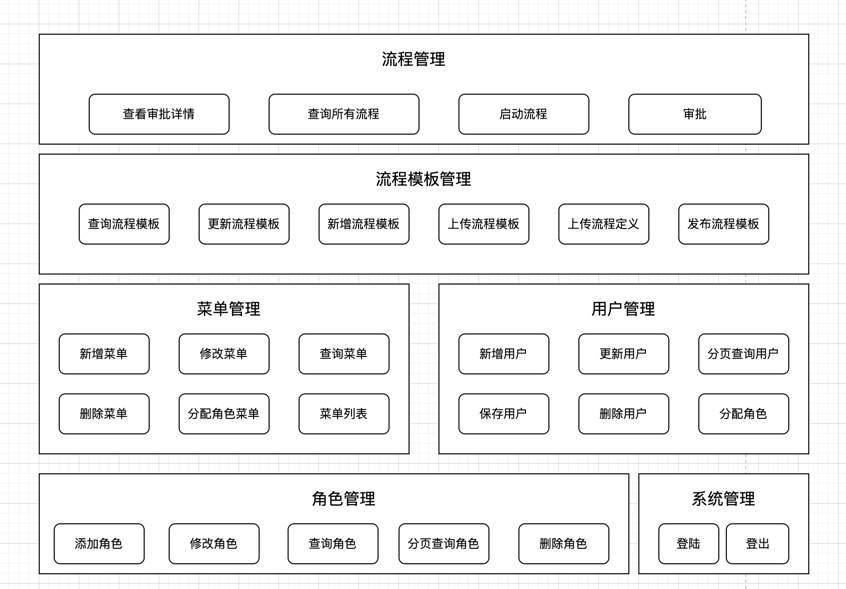
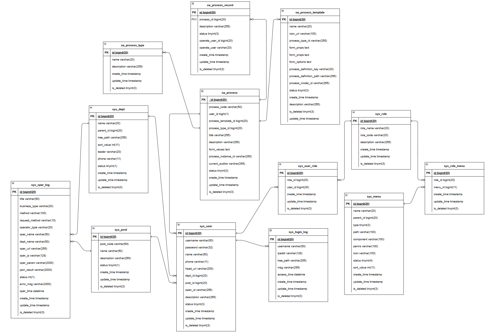

# 项目介绍

该项目实现了一个OA系统，基于Spring技术栈+mybatis plus + Activiti框架实现了OA流程的创建管理。系统主要包含如下功能：

- 角色管理：实现了角色的增删改查
- 菜单管理：菜单的增删改查，并且实现了基于角色控制的权限控制 
- 用户管理：用户的增删改查，通过角色来管理用户的权限
- 流程模板管理：实现流程模板的发布，和更新
- 流程管理：实现了流程的发起，审批等

详细的功能参考如下架构图：

# ER图

项目相关表的ER图如下所示

