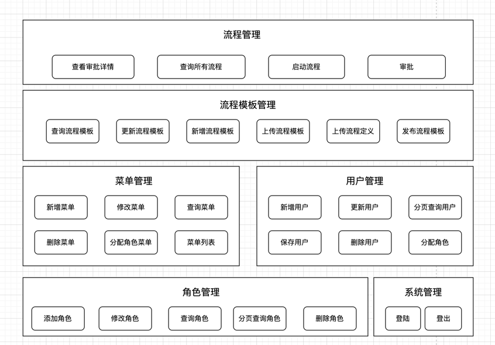
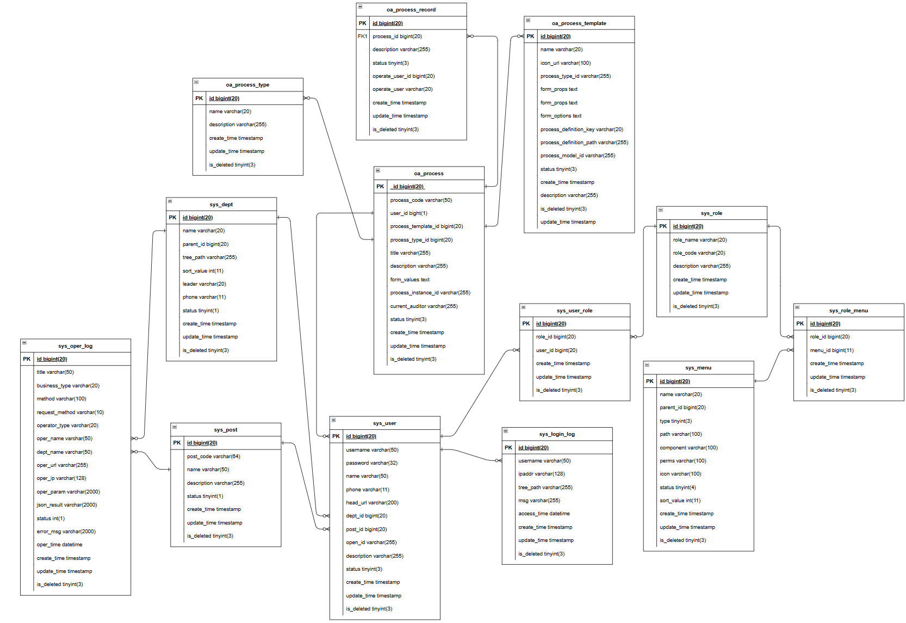

# 项目介绍

该项目实现了一个OA系统，基于Spring技术栈+mybatis plus + Activiti框架实现了OA流程的创建管理。系统主要包含如下功能：

- 角色管理：实现了角色的增删改查
- 菜单管理：菜单的增删改查，并且实现了基于角色控制的权限控制 
- 用户管理：用户的增删改查，通过角色来管理用户的权限
- 流程模板管理：实现流程模板的发布，和更新
- 流程管理：实现了流程的发起，审批等

详细的功能参考如下架构图：




# ER图

项目相关表的ER图如下所示




# 部署
```shell
git clone https://github.com/yinhao-2000/OA_test.git
sh deploy.sh
```

当前服务已经部署到云服务器，可直接测试:

登陆请求,获取token信息
```shell
curl --location 'http://119.91.203.81:8088/admin/system/index/login' \
--header 'Content-Type: application/json' \
--header 'Cookie: SESSIONID=c754107b-21a5-44d1-8f49-560846b945a6.NfOdL7tCcOsze8zKE3LixllmLuE' \
--data '{
  "username": "yinhao",
  "password":"yinhaotest"
}'
```

查询菜单（将获取的token信息放入到header）
```shell
curl --location 'http://119.91.203.81:8088/admin/wechat/menu/findMenuInfo' \
--header 'token: eyJhbGciOiJIUzUxMiIsInppcCI6IkdaSVAifQ.H4sIAAAAAAAAAKtWKi5NUrJScgwN8dANDXYNUtJRSq0oULIyNDc2NLYwMTI111EqLU4t8kwBikGYeYm5qUAtlZl5GYn5SrUAeo2CbUMAAAA.DE_JIBLhtDN1Wv8JhGWZ1i--dAPDLddMvQrqn6ejsywbxfkTERgrGj-NcATFMllTM4LsEnNRSjzzstNHh5-m2A' \
--header 'Cookie: SESSIONID=c754107b-21a5-44d1-8f49-560846b945a6.NfOdL7tCcOsze8zKE3LixllmLuE' \
```